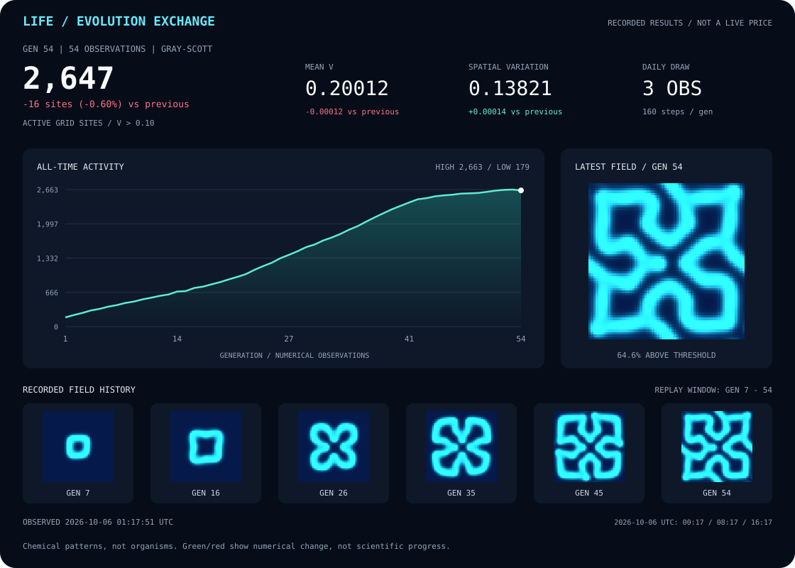

# Life Simulation: From Chemistry to Order

**Aim:** explore how life might begin by asking how simple chemical interactions
can organize themselves into persistent patterns. This AI-authored experiment
offers a visual interpretation of one possible ingredient in life's origins:
self-organization in a system supplied with matter.

The current model is a [Gray–Scott reaction-diffusion](https://en.wikipedia.org/wiki/Gray%E2%80%93Scott_model)
system, not a reconstruction of early Earth or a simulation of living organisms.
It does not model genetic information, membranes, metabolism, reproduction, or
Darwinian evolution. An organized pattern is not evidence that life has emerged.

[Open the live dashboard](https://gencay.github.io/life-simulation/)

**The evolution tape:** a market-style view of real simulation measurements,
not financial data. The line tracks every generation; the cards show change
since the previous observation, and the field strip samples saved snapshots.
Green/red indicate increase/decrease, not progress toward life.

[Full measurement history](simulation/history.csv) ·
[Interactive charts and replay](https://gencay.github.io/life-simulation/)

Latest full-size concentration field

## Watch the experiment evolve

The dashboard combines a concentration field, a selectable historical chart
(active area, mean concentration, and spatial variation), and recorded-generation
playback. The newest 48 field snapshots are available for replay; the complete
measurement history is retained. These are actual saved results, not a fabricated
animation. "Active sites" means grid sites above a concentration threshold, not
biological cells.

An AI-authored interpretation explains self-organization and relates the latest
measurements to the previous observation. The changing text uses transparent,
fixed rules; no AI model is called during scheduled runs, and it does not make
claims about life appearing.

The page checks for new published results every minute while visible. New
simulation observations are scheduled 3–6 times daily, not continuously in the
browser. Historical playback is labelled separately from the latest observation.

## Observations and publication

Each UTC day, a reproducible, date-seeded random draw chooses **3–6 scheduled
generations**. The workflow checks six windows at 00:17, 04:17, 08:17, 12:17,
16:17, and 20:17 UTC. The 00:17, 08:17, and 16:17 windows are always selected;
the draw adds zero to three of the other windows. Unselected windows and retries
of already committed windows do not advance the state or create commits.

**The draw influences the next generation:** a budget of 480 numerical steps
is divided across the selected observations:

| Daily draw | Steps per generation |
| --- | --- |
| 3 | 160 |
| 4 | 120 |
| 5 | 96 |
| 6 | 80 |

Fewer observations let the field evolve further before the next snapshot.
The chemical parameters stay unchanged, and a complete scheduled day advances
480 steps in total. The seed, selected windows, daily count, and actual step count
are recorded with the results; older history is preserved with missing cadence
fields left blank rather than invented.

Each selected run:

1. Tests the numerical model.
2. Advances the persisted field by the daily draw's step count.
3. Renders the latest field and README evolution ticker as SVGs.
4. Records concentration and activity measurements.
5. Commits the evolved state and dashboard data.
6. Deploys the updated GitHub Pages dashboard.

Each generation has its own commit, authored and committed as
`gencay <gencay.ali@hotmail.com>`. Earlier commit identities have been
normalized to this identity, preserving original dates and simulation results.
GitHub Actions still executes the automation and authenticates the push.

GitHub schedules are best-effort and can occasionally start later than the
configured time or miss windows. Delayed jobs use their execution-time UTC
four-hour window; the 3–6 count is a plan, not an uptime guarantee. The first day
after a mid-day rollout may have fewer selected windows remaining.

Manual dispatch and dashboard/model changes pushed to `main` create additional
observations using that day's step count; they do not consume scheduled windows.
Every check also republishes the committed dashboard, even when no generation
is due, allowing failed deployments to recover without a duplicate generation.
The README SVG updates in each generation commit; GitHub may cache its image.
There is no universal scientific wall-clock schedule for this model. Numerical
steps use timestep 1 in model units, not hours of early-Earth history.

Full concentration fields, measurements, and previous versions remain auditable
in this repository's commit history.

## Continuing development

[Project instructions and session handoff](AGENTS.md) records the owner's
requirements, architecture, commit identity, and automation details for future
sessions and devices.
